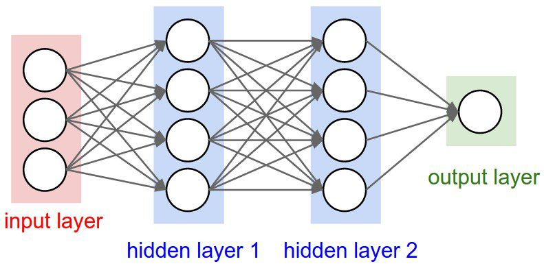

# Pytorch: Ways to build PyTorch models using \[Module, Sequential, ModuleList and ModuleDict\]




</div>

<div class="cell code" execution_count="14">

``` python
import torch
from torch import nn

model_0 = nn.Sequential(
    nn.Flatten(),
    nn.Linear(150528,10),
    nn.Linear(10,2)
)

model_1 = nn.Sequential(
    nn.Conv2d(3,64,(3,3)),
    nn.Conv2d(64,128,(3,3)),
    nn.Dropout(p=0.2),
    nn.Conv2d(128,3,(3,3)),
)

model_2 = nn.Sequential(
    model_1,
    nn.Flatten(),
    nn.Linear(142572,15)
)
```

</div>

<div class="cell code" execution_count="15">

``` python
rand_img = torch.randn((1,3,224,224)) # 3*224*224 -> 150528
out_0 = model_0(rand_img)
print(out_0.shape)

out_1 = model_1(rand_img)
print(out_1.shape)

out_2 = model_2(rand_img)
print(out_2.shape)
```

<div class="output stream stdout">

    torch.Size([1, 2])
    torch.Size([1, 3, 218, 218])
    torch.Size([1, 15])

</div>

</div>

<div class="cell markdown">

# how to build using class

# lets create a classic cnn classifier

</div>

<div class="cell code" execution_count="17">

``` python
import torch.nn.functional as F

class MyCNNClassifier(nn.Module):
    def __init__(self,in_c,n_classes):
        super(MyCNNClassifier,self).__init__()

        self.conv1 = nn.Conv2d(in_c,32,
                            kernel_size=3,stride=1,padding=1)
        self.bn1 = nn.BatchNorm2d(32)

        self.conv2 = nn.Conv2d(32,64,
                            kernel_size=3,stride=1,padding=1)
        self.bn1 = nn.BatchNorm2d(64)

        self.fc1 = nn.Linear(64*28*28,1024)
        self.fc2 = nn.Linear(1024,n_classes)

    def forward(self, x:torch.Tensor) -> torch.Tensor:
        x1 = self.conv1(x)
        x2 = self.bn1(x1)
        x3 = F.relu(x2)

        x4 = self.conv2(x3)
        x5 = self.bn2(x4)
        x6 = F.relu(x5)

        x7 = x6.view(x.size(0),-1)

        x8 = self.fc1(x7)
        x9 = F.sigmoid(x8)
        x10 = self.fc2(x9)
        return x10
```

</div>

<div class="cell code" execution_count="18">

``` python
model = MyCNNClassifier(1,10)
print(model)
```

<div class="output stream stdout">

    MyCNNClassifier(
      (conv1): Conv2d(1, 32, kernel_size=(3, 3), stride=(1, 1), padding=(1, 1))
      (bn1): BatchNorm2d(64, eps=1e-05, momentum=0.1, affine=True, track_running_stats=True)
      (conv2): Conv2d(32, 64, kernel_size=(3, 3), stride=(1, 1), padding=(1, 1))
      (fc1): Linear(in_features=50176, out_features=1024, bias=True)
      (fc2): Linear(in_features=1024, out_features=10, bias=True)
    )

</div>

</div>

<div class="cell code" execution_count="21">

``` python
# can we add sequential with class

class MyCNNClassifier(nn.Module):
    def __init__(self,in_c,n_classes):
        super(MyCNNClassifier,self).__init__()

        self.conv_block1 = nn.Sequential(
            nn.Conv2d(in_c,32,kernel_size=3,stride=1,padding=1),
            nn.BatchNorm2d(32),
            nn.ReLU()
        )

        self.conv_block2 = nn.Sequential(
            nn.Conv2d(32,64,kernel_size=3,stride=1,padding=1),
            nn.BatchNorm2d(64),
            nn.ReLU()
        )

        self.decoder = nn.Sequential(
            nn.Linear(64*28*28,1024),
            nn.Sigmoid(),
            nn.Linear(1024,n_classes)
        )

    def forward(self, x:torch.Tensor) -> torch.Tensor:
        x = self.conv_block1(x)
        x = self.conv_block2(x)
        x = x.view(x.size(0),-1)
        x = self.decoder(x)

        return x     


        # inside the forward method self.con1 -> self.bn1 -> RELu()
```

</div>

<div class="cell code" execution_count="22">

``` python
model = MyCNNClassifier(1,10)
print(model)
```

<div class="output stream stdout">

    MyCNNClassifier(
      (conv_block1): Sequential(
        (0): Conv2d(1, 32, kernel_size=(3, 3), stride=(1, 1), padding=(1, 1))
        (1): BatchNorm2d(32, eps=1e-05, momentum=0.1, affine=True, track_running_stats=True)
        (2): ReLU()
      )
      (conv_block2): Sequential(
        (0): Conv2d(32, 64, kernel_size=(3, 3), stride=(1, 1), padding=(1, 1))
        (1): BatchNorm2d(64, eps=1e-05, momentum=0.1, affine=True, track_running_stats=True)
        (2): ReLU()
      )
      (decoder): Sequential(
        (0): Linear(in_features=50176, out_features=1024, bias=True)
        (1): Sigmoid()
        (2): Linear(in_features=1024, out_features=10, bias=True)
      )
    )

</div>

</div>

<div class="cell code" execution_count="23">

``` python
def conv_block(in_f,out_f, *args, **kwargs):
    return nn.Sequential(
        nn.Conv2d(in_f,out_f,*args,**kwargs),
        nn.BatchNorm2d(out_f),
        nn.ReLU()
    )
```

</div>

<div class="cell code" execution_count="24">

``` python
# conv block 1 and conv block 2 are almost the same we can merge them using seq
class MyCNNClassifier(nn.Module):
    def __init__(self,in_c,n_classes):
        super(MyCNNClassifier,self).__init__()

        self.encoder = nn.Sequential(
            conv_block(in_c,32,kernel_size=3,stride=1,padding=1),
            conv_block(32,64,kernel_size=3,stride=1,padding=1),
        )

        
        self.decoder = nn.Sequential(
            nn.Linear(64*28*28,1024),
            nn.Sigmoid(),
            nn.Linear(1024,n_classes)
        )

    def forward(self,x:torch.Tensor) -> torch.Tensor:
        x = self.encoder(x)
        x = x.view(x.size(0),-1)
        x = self.decoder(x)
        return x 

```

</div>

<div class="cell code" execution_count="25">

``` python
model = MyCNNClassifier(1,10)
print(model)
```

<div class="output stream stdout">

    MyCNNClassifier(
      (encoder): Sequential(
        (0): Sequential(
          (0): Conv2d(1, 32, kernel_size=(3, 3), stride=(1, 1), padding=(1, 1))
          (1): BatchNorm2d(32, eps=1e-05, momentum=0.1, affine=True, track_running_stats=True)
          (2): ReLU()
        )
        (1): Sequential(
          (0): Conv2d(32, 64, kernel_size=(3, 3), stride=(1, 1), padding=(1, 1))
          (1): BatchNorm2d(64, eps=1e-05, momentum=0.1, affine=True, track_running_stats=True)
          (2): ReLU()
        )
      )
      (decoder): Sequential(
        (0): Linear(in_features=50176, out_features=1024, bias=True)
        (1): Sigmoid()
        (2): Linear(in_features=1024, out_features=10, bias=True)
      )
    )

</div>

</div>

<div class="cell markdown">

# what if i needed to add more layer in the encoder ?

""" self.encoder = nn.Sequential(
conv_block(in_c,32,kernel_size=3,stride=1,padding=1),
conv_block(32,64,kernel_size=3,stride=1,padding=1),
conv_block(64,128,kernel_size=3,stride=1,padding=1),
conv_block(128,256,kernel_size=3,stride=1,padding=1),
conv_block(256,512,kernel_size=3,stride=1,padding=1), ) """

# this is not good enough

</div>

<div class="cell code" execution_count="27">

``` python
sizes = [3,64,128,256,512]
for in_f , out_f in zip(sizes,sizes[1:]):
    print(in_f,out_f)
```

<div class="output stream stdout">

    3 64
    64 128
    128 256
    256 512

</div>

</div>

<div class="cell code" execution_count="28">

``` python
class MyCNNClassifier(nn.Module):
    def __init__(self,in_c,n_classes):
        super(MyCNNClassifier,self).__init__()

        self.enc_sizes = [in_c,32,64]

        conv_blocks = [conv_block(in_f,out_f,kernel_size=3 ,padding=1)
                       for in_f , out_f in zip(self.enc_sizes , self.enc_sizes[1:])] # uses a list comprehension
        
        self.encoder = nn.Sequential(*conv_blocks)

        self.decoder = nn.Sequential(
            nn.Linear(64*28*28,1024),
            nn.Sigmoid(),
            nn.Linear(1024,n_classes)
        )

    def forward(self, x: torch.Tensor) -> torch.Tensor:
        x = self.encoder(x)
        x = x.view(x.size(0),-1)
        x = self.decoder(x)

        return x
```

</div>

<div class="cell code" execution_count="29">

``` python
model = MyCNNClassifier(1,10)
print(model)
```

<div class="output stream stdout">

    MyCNNClassifier(
      (encoder): Sequential(
        (0): Sequential(
          (0): Conv2d(1, 32, kernel_size=(3, 3), stride=(1, 1), padding=(1, 1))
          (1): BatchNorm2d(32, eps=1e-05, momentum=0.1, affine=True, track_running_stats=True)
          (2): ReLU()
        )
        (1): Sequential(
          (0): Conv2d(32, 64, kernel_size=(3, 3), stride=(1, 1), padding=(1, 1))
          (1): BatchNorm2d(64, eps=1e-05, momentum=0.1, affine=True, track_running_stats=True)
          (2): ReLU()
        )
      )
      (decoder): Sequential(
        (0): Linear(in_features=50176, out_features=1024, bias=True)
        (1): Sigmoid()
        (2): Linear(in_features=1024, out_features=10, bias=True)
      )
    )

</div>

</div>

<div class="cell code" execution_count="30">

``` python
from torchinfo import summary
summary(model,input_size=(1,1,28,28))
```

<div class="output execute_result" execution_count="30">

    ==========================================================================================
    Layer (type:depth-idx)                   Output Shape              Param #
    ==========================================================================================
    MyCNNClassifier                          [1, 10]                   --
    ├─Sequential: 1-1                        [1, 64, 28, 28]           --
    │    └─Sequential: 2-1                   [1, 32, 28, 28]           --
    │    │    └─Conv2d: 3-1                  [1, 32, 28, 28]           320
    │    │    └─BatchNorm2d: 3-2             [1, 32, 28, 28]           64
    │    │    └─ReLU: 3-3                    [1, 32, 28, 28]           --
    │    └─Sequential: 2-2                   [1, 64, 28, 28]           --
    │    │    └─Conv2d: 3-4                  [1, 64, 28, 28]           18,496
    │    │    └─BatchNorm2d: 3-5             [1, 64, 28, 28]           128
    │    │    └─ReLU: 3-6                    [1, 64, 28, 28]           --
    ├─Sequential: 1-2                        [1, 10]                   --
    │    └─Linear: 2-3                       [1, 1024]                 51,381,248
    │    └─Sigmoid: 2-4                      [1, 1024]                 --
    │    └─Linear: 2-5                       [1, 10]                   10,250
    ==========================================================================================
    Total params: 51,410,506
    Trainable params: 51,410,506
    Non-trainable params: 0
    Total mult-adds (M): 66.14
    ==========================================================================================
    Input size (MB): 0.00
    Forward/backward pass size (MB): 1.21
    Params size (MB): 205.64
    Estimated Total Size (MB): 206.86
    ==========================================================================================

</div>

</div>

<div class="cell code" execution_count="34">

``` python
class MyCNNClassifier(nn.Module):
    def __init__(self,in_c,enc_sizes,n_classes):
        super(MyCNNClassifier,self).__init__()

        self.enc_sizes = [in_c,*enc_sizes]

        conv_blocks = [conv_block(in_f,out_f,kernel_size=3 ,padding=1)
                    for in_f , out_f in zip(self.enc_sizes , self.enc_sizes[1:])] # uses a list comprehension
        

        self.encoder = nn.Sequential(*conv_blocks)

        self.decoder = nn.Sequential(
            nn.Linear(64*28*28,1024),
            nn.Sigmoid(),
            nn.Linear(1024,n_classes)
        )

    def forward(self, x : torch.Tensor) -> torch.Tensor:
        x = self.encoder(x)
        x = x.view(x.size(0),-1)
        x = self.decoder(x)

        return x
```

</div>

<div class="cell code" execution_count="37">

``` python
model = MyCNNClassifier(1,[32,64,128],10)
print(model)
```

<div class="output stream stdout">

    MyCNNClassifier(
      (encoder): Sequential(
        (0): Sequential(
          (0): Conv2d(1, 32, kernel_size=(3, 3), stride=(1, 1), padding=(1, 1))
          (1): BatchNorm2d(32, eps=1e-05, momentum=0.1, affine=True, track_running_stats=True)
          (2): ReLU()
        )
        (1): Sequential(
          (0): Conv2d(32, 64, kernel_size=(3, 3), stride=(1, 1), padding=(1, 1))
          (1): BatchNorm2d(64, eps=1e-05, momentum=0.1, affine=True, track_running_stats=True)
          (2): ReLU()
        )
        (2): Sequential(
          (0): Conv2d(64, 128, kernel_size=(3, 3), stride=(1, 1), padding=(1, 1))
          (1): BatchNorm2d(128, eps=1e-05, momentum=0.1, affine=True, track_running_stats=True)
          (2): ReLU()
        )
      )
      (decoder): Sequential(
        (0): Linear(in_features=50176, out_features=1024, bias=True)
        (1): Sigmoid()
        (2): Linear(in_features=1024, out_features=10, bias=True)
      )
    )

</div>

</div>

<div class="cell code" execution_count="38">

``` python
def dec_block(in_f,out_f):
    return nn.Sequential(
        nn.Linear(in_f,out_f),
        nn.Sigmoid(),
    )
```

</div>

<div class="cell code" execution_count="39">

``` python
class MyCNNClassifier(nn.Module):
    def __init__(self,in_c,enc_sizes,dec_sizes,n_classes):
        super(MyCNNClassifier,self).__init__()

        self.enc_sizes = [in_c,*enc_sizes]
        self.dec_sizes = [64*28*28,*dec_sizes] # the encoder return 64*28*28

        conv_blocks = [conv_block(in_f,out_f,kernel_size=3 ,padding=1)
                    for in_f , out_f in zip(self.enc_sizes , self.enc_sizes[1:])] # uses a list comprehension
        
        dec_blocks = [dec_block(in_f,out_f)
                    for in_f , out_f in zip(self.dec_sizes,self.dec_sizes[1:])]
        
        self.encoder = nn.Sequential(*conv_blocks)

        self.decoder = nn.Sequential(*dec_blocks)

        self.last = nn.Linear(self.dec_sizes[-1],n_classes)

    
    def forward(self, x : torch.Tensor) -> torch.Tensor:
        x = self.encoder(x)
        x = x.view(x.size(0),-1)
        x = self.decoder(x)

        return x
```

</div>

<div class="cell code" execution_count="41">

``` python
model = MyCNNClassifier(1,[32,64],[1024,512],10)
print(model)
```

<div class="output stream stdout">

    MyCNNClassifier(
      (encoder): Sequential(
        (0): Sequential(
          (0): Conv2d(1, 32, kernel_size=(3, 3), stride=(1, 1), padding=(1, 1))
          (1): BatchNorm2d(32, eps=1e-05, momentum=0.1, affine=True, track_running_stats=True)
          (2): ReLU()
        )
        (1): Sequential(
          (0): Conv2d(32, 64, kernel_size=(3, 3), stride=(1, 1), padding=(1, 1))
          (1): BatchNorm2d(64, eps=1e-05, momentum=0.1, affine=True, track_running_stats=True)
          (2): ReLU()
        )
      )
      (decoder): Sequential(
        (0): Sequential(
          (0): Linear(in_features=50176, out_features=1024, bias=True)
          (1): Sigmoid()
        )
        (1): Sequential(
          (0): Linear(in_features=1024, out_features=512, bias=True)
          (1): Sigmoid()
        )
      )
      (last): Linear(in_features=512, out_features=10, bias=True)
    )

</div>

</div>

<div class="cell code" execution_count="59">

``` python
# to upscale our code level

class MyEncoder(nn.Module):
    def __init__(self,enc_sizes):
        super(MyEncoder, self).__init__()
        self.conv_blocks = nn.Sequential(*[conv_block(in_f,out_f,kernel_size=3 ,padding=1)
                    for in_f , out_f in zip(enc_sizes , enc_sizes[1:])] # uses a list comprehension
                                        )
    def forward(self,x: torch.Tensor) -> torch.Tensor:
        return self.conv_blocks(x)
    
    
```

</div>

<div class="cell code" execution_count="60">

``` python
class MyDecoder(nn.Module):
    def __init__(self,dec_sizes,n_classes):
        super(MyDecoder, self).__init__()
        self.dec_blocks = nn.Sequential(*[dec_block(in_f,out_f)
                    for in_f , out_f in zip(dec_sizes,dec_sizes[1:])]
                                    )
        self.last = nn.Linear(dec_sizes[-1],n_classes)

    def forward(self,x: torch.Tensor) -> torch.Tensor:
        
        x = self.dec_blocks(x)
        x = self.last(x)

        return x
```

</div>

<div class="cell code" execution_count="64">

``` python
class MyCNNClassifier(nn.Module):
    def __init__(self,in_c,enc_sizes,dec_sizes,n_classes,im_dim):
        super(MyCNNClassifier,self).__init__()

        self.enc_sizes = [in_c,*enc_sizes]
        self.dec_sizes = [self.enc_sizes[-1] * im_dim*im_dim , *dec_sizes]

        self.encoder = MyEncoder(self.enc_sizes)

        self.decoder = MyDecoder(self.dec_sizes,n_classes)

    def forward(self,x : torch.Tensor) -> torch.Tensor:
        x = self.encoder(x)
        x = x.flatten(1)
        x = self.decoder(x)

        return x
```

</div>

<div class="cell code" execution_count="74">

``` python
model = MyCNNClassifier(1,[32,64],[1024,512],10,30)
print(model)
```

<div class="output stream stdout">

    MyCNNClassifier(
      (encoder): MyEncoder(
        (conv_blocks): Sequential(
          (0): Sequential(
            (0): Conv2d(1, 32, kernel_size=(3, 3), stride=(1, 1), padding=(1, 1))
            (1): BatchNorm2d(32, eps=1e-05, momentum=0.1, affine=True, track_running_stats=True)
            (2): ReLU()
          )
          (1): Sequential(
            (0): Conv2d(32, 64, kernel_size=(3, 3), stride=(1, 1), padding=(1, 1))
            (1): BatchNorm2d(64, eps=1e-05, momentum=0.1, affine=True, track_running_stats=True)
            (2): ReLU()
          )
        )
      )
      (decoder): MyDecoder(
        (dec_blocks): Sequential(
          (0): Sequential(
            (0): Linear(in_features=57600, out_features=1024, bias=True)
            (1): Sigmoid()
          )
          (1): Sequential(
            (0): Linear(in_features=1024, out_features=512, bias=True)
            (1): Sigmoid()
          )
        )
        (last): Linear(in_features=512, out_features=10, bias=True)
      )
    )

</div>

</div>

<div class="cell code" execution_count="75">

``` python
summary(model,input_size=(1,1,30,30))
```

<div class="output execute_result" execution_count="75">

    ==========================================================================================
    Layer (type:depth-idx)                   Output Shape              Param #
    ==========================================================================================
    MyCNNClassifier                          [1, 10]                   --
    ├─MyEncoder: 1-1                         [1, 64, 30, 30]           --
    │    └─Sequential: 2-1                   [1, 64, 30, 30]           --
    │    │    └─Sequential: 3-1              [1, 32, 30, 30]           384
    │    │    └─Sequential: 3-2              [1, 64, 30, 30]           18,624
    ├─MyDecoder: 1-2                         [1, 10]                   --
    │    └─Sequential: 2-2                   [1, 512]                  --
    │    │    └─Sequential: 3-3              [1, 1024]                 58,983,424
    │    │    └─Sequential: 3-4              [1, 512]                  524,800
    │    └─Linear: 2-3                       [1, 10]                   5,130
    ==========================================================================================
    Total params: 59,532,362
    Trainable params: 59,532,362
    Non-trainable params: 0
    Total mult-adds (M): 76.45
    ==========================================================================================
    Input size (MB): 0.00
    Forward/backward pass size (MB): 1.39
    Params size (MB): 238.13
    Estimated Total Size (MB): 239.53
    ==========================================================================================

</div>

</div>

<div class="cell markdown">

# Module List

unlike list comp with seq. with module list you can trace and access the
elments like a regular python list

</div>

<div class="cell code" execution_count="76">

``` python
class MyModule(nn.Module):
    def __init__(self,sizes):
        super(MyModule,self).__init__()
        self.layer = nn.ModuleList([nn.Linear(in_c,out_c)
                        for in_c , out_c in zip(sizes , sizes[1:])])
        
        self.trace = []

    def forward(self,x):
        for layer in self.layer:
            x = layer(x)
            self.trace.append(x)
        return x
```

</div>

<div class="cell code" execution_count="77">

``` python
model = MyModule([1,16,32])
model(torch.rand((4,1)))
[print(trace.shape) for trace in model.trace]
```

<div class="output stream stdout">

    torch.Size([4, 16])
    torch.Size([4, 32])

</div>

<div class="output execute_result" execution_count="77">

    [None, None]

</div>

</div>

<div class="cell markdown">

# ModuleDict

</div>

<div class="cell code" execution_count="78">

``` python
def conv_block(in_f, out_f , activation = 'relu',*args , **kwargs):
    activations = nn.ModuleDict([
        ['lrelu',nn.LeakyReLU()],
        ['relu',nn.ReLU()]
    ])

    return nn.Sequential(
        nn.Conv2d(in_f,out_f,*args,**kwargs),
        nn.BatchNorm2d(out_f),
        activations[activation]
    )
```

</div>

<div class="cell code" execution_count="80">

``` python
print(conv_block(1,32,'lrelu',kernel_size = 3,padding=1))
print(conv_block(1,32,'relu',kernel_size = 3,padding=1))
```

<div class="output stream stdout">

    Sequential(
      (0): Conv2d(1, 32, kernel_size=(3, 3), stride=(1, 1), padding=(1, 1))
      (1): BatchNorm2d(32, eps=1e-05, momentum=0.1, affine=True, track_running_stats=True)
      (2): LeakyReLU(negative_slope=0.01)
    )
    Sequential(
      (0): Conv2d(1, 32, kernel_size=(3, 3), stride=(1, 1), padding=(1, 1))
      (1): BatchNorm2d(32, eps=1e-05, momentum=0.1, affine=True, track_running_stats=True)
      (2): ReLU()
    )

</div>

</div>

<div class="cell code">

``` python
```

</div>
